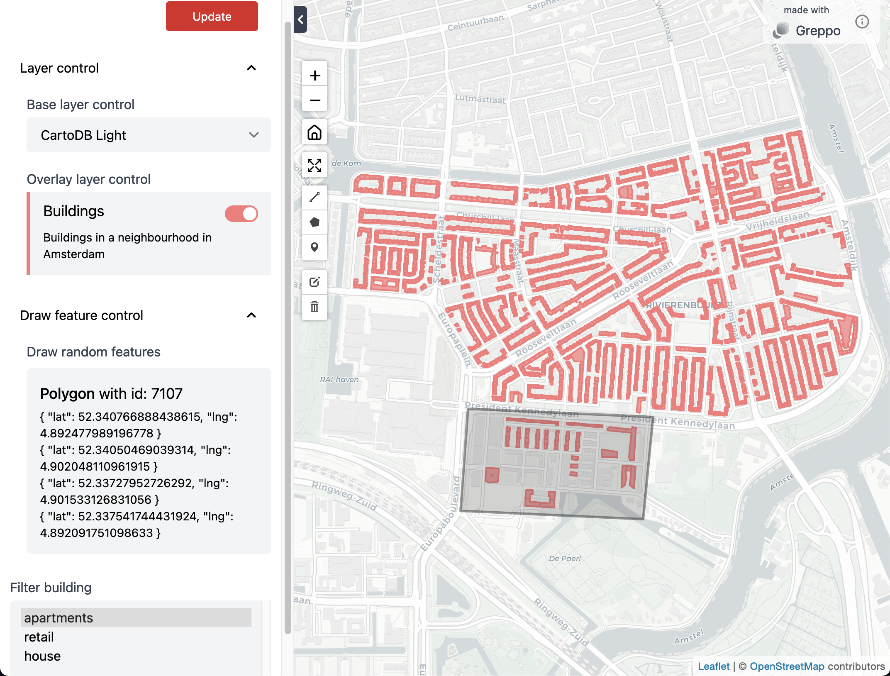

# Demo

Here are a few examples of the use-cases to use Greppo. The scripts are provided here along with their output screenshot.

To serve the app, run the following command on the terminal:

```shell
$ greppo serve app.py
```

## 1. Visualizing overlay layers with a base layer

### Script - app.py 

```python
from greppo import app
import geopandas as gpd

app.base_layer(
    name="CartoDB Light",
    visible=True,
    url="https://cartodb-basemaps-a.global.ssl.fastly.net/light_all/{z}/{x}/{y}@2x.png",
    subdomains=None,
    attribution='&copy; <a target="_blank" href="http://osm.org/copyright">OpenStreetMap</a> contributors',
)

buildings_gdf = gpd.read_file("./data/buildings.geojson")

app.overlay_layer(
    buildings_gdf,
    title="Buildings",
    description="Buildings in a neighbourhood in Amsterdam",
    style={"fillColor": "#F87979"},
    visible=True,
)
```

### Browser - localhost:8000/


## 2. Adding a multiselect component to filter the geodataframe and add a draw feature

### Script - app.py 

```python
from greppo import app
import geopandas as gpd

app.base_layer(
    name="CartoDB Light",
    visible=True,
    url="https://cartodb-basemaps-a.global.ssl.fastly.net/light_all/{z}/{x}/{y}@2x.png",
    subdomains=None,
    attribution='&copy; <a target="_blank" href="http://osm.org/copyright">OpenStreetMap</a> contributors',
)

buildings_gdf = gpd.read_file("./data/buildings.geojson")

filter_select = app.multiselect(name="Filter building", options=["apartments", "retail", "house"], default=["house"])

buildings_gdf_filtered = buildings_gdf[buildings_gdf.building == filter_select.get_value()[0]]

app.overlay_layer(
    buildings_gdf_filtered,
    title="Buildings",
    description="Buildings in a neighbourhood in Amsterdam",
    style={"fillColor": "#F87979"},
    visible=True,
)

# Initialize an empty GeoDataFrame for referencing the draw features.
draw_features = gpd.GeoDataFrame()
draw_feature_input = app.draw_feature(
    name="Draw random features", features=draw_features
)
```

### Browser - localhost:8000/

